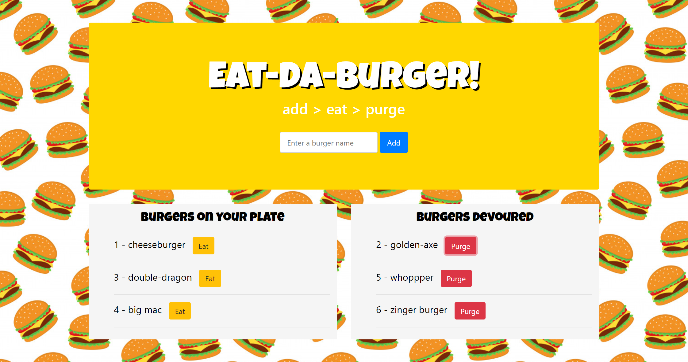

# burger 
Week 14 project - Node.js application with Express, Handlebars, Mysql, Heroku

## Deployed App
[Eat-Da-Burger](https://shrouded-plateau-50291.herokuapp.com/)

## Description
* Eat-Da-Burger! is a restaurant app that lets users input the names of burgers they'd like to eat.
* Whenever a user submits a burger's name, the app will add the burger to the user's plate (leftside panel) - waiting to be devoured.
* Each burger on the left also has a `Devour` button. When the user clicks it, the burger will move to the right side of the page.ad
* The app stores every burger in a database, whether devoured or not.

## Preview


## Prerequisites
* install node.js
* run 'npm i' to install required packages
* run schema.sql in MySQL Workbench to create database

## Application structure

```
.
├── config
│   ├── connection.js
│   └── orm.js
│ 
├── controllers
│   └── burgers_controller.js
│
├── db
│   ├── schema.sql
│   └── seeds.sql
│
├── models
│   └── burger.js
│ 
├── node_modules
│ 
├── package.json
│
├── public
│   └── assets
│       ├── css
│       │   └── burger_style.css
│       └── img
│           └── burger.png
│   
│
├── server.js
│
└── views
    ├── index.handlebars
    └── layouts
        └── main.handlebars
```

## Built with
* javascript
* node.js
* npm packages:
  - [mysql](https://www.npmjs.com/package/mysql)
  - [express-handlebars](https://www.npmjs.com/package/express-handlebars)
  - [cli-table](https://www.npmjs.com/package/cli-table)
* MySQLWorkbench
* Heroku

## Folder structure of MVC

**Models** folder contains model class files. Typically model class includes public properties, which will be used by application to hold and manipulate application data.

**Controllers** folder contains class files for the controllers. Controllers handles users’ request and returns a response. MVC requires the name of all controller files to end with “Controller”.

**View** folder stores the HTML files related to application display and user interface. Typically view file is a .cshtml file where you write html and C# or VB.NET code.

config/ Holds the general configuration of the project.

data/ Here, you can store the data files of the project, like a database schema, a SQL file that creates tables, or even a SQLite database file.    
